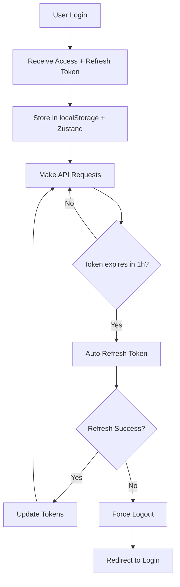

# 🔐 Enhanced Authentication System Guide

## 📋 Tổng quan

Hệ thống xác thực nâng cấp cho E-Football Shop với các tính năng bảo mật cao cấp:

- ✅ **Token có thời hạn 24 giờ** với refresh token 7 ngày
- ✅ **Tự động refresh token** trước khi hết hạn
- ✅ **Token Rotation** để bảo mật tối đa
- ✅ **Request Queuing** khi refresh token
- ✅ **Enhanced Error Handling** với retry logic
- ✅ **Professional UI/UX** với real-time status

## 🏗️ Kiến trúc hệ thống

```
📁 src/
├── 🎣 hooks/
│   └── useAuth.js              # Hook quản lý authentication
├── 🔧 services/
│   └── tokenInterceptor.js     # Singleton class xử lý API
├── 🎨 components/
│   └── AdminLoginImproved.jsx  # Component login nâng cao
├── 🗄️ store/
│   └── auth.ts                 # Zustand store (đã cập nhật)
└── 📄 AUTH_SYSTEM_GUIDE.md     # Tài liệu này
```

## 🚀 Cách sử dụng

### 1. Hook useAuth

```javascript
import { useAuth } from '@/hooks/useAuth';

function MyComponent() {
  const { 
    isAuthenticated, 
    user, 
    login, 
    logout, 
    tokenStatus 
  } = useAuth();
  
  // Sử dụng trong component
  if (!isAuthenticated) {
    return <LoginForm />;
  }
  
  return (
    <div>
      <p>Xin chào {user?.username}!</p>
      <p>Token còn: {tokenStatus.timeRemaining}ms</p>
      {tokenStatus.isRefreshing && <p>Đang làm mới token...</p>}
    </div>
  );
}
```

### 2. TokenInterceptor Service

```javascript
import TokenInterceptor from '@/services/tokenInterceptor';

// Sử dụng thay thế cho axios
const api = TokenInterceptor.getInstance();

// GET request
const users = await api.get('/api/users');

// POST request
const newUser = await api.post('/api/users', userData);

// Upload file
const result = await api.upload('/api/upload', formData);

// Kiểm tra trạng thái
if (api.isAuthenticated()) {
  console.log('Đã đăng nhập');
}
```

### 3. Component AdminLoginImproved

```jsx
import AdminLoginImproved from '@/components/AdminLoginImproved';

// Sử dụng trong trang login
export default function LoginPage() {
  return <AdminLoginImproved />;
}
```

## 🔧 Cấu hình

### Environment Variables

```env
# Backend URL
NEXT_PUBLIC_API_URL=http://localhost:5002

# Token settings
TOKEN_REFRESH_THRESHOLD=3600000  # 1 hour in ms
TOKEN_EXPIRY=86400000           # 24 hours in ms
REFRESH_TOKEN_EXPIRY=604800000  # 7 days in ms
```

### Backend Endpoints Required

```javascript
// 1. Admin Login
POST /api/auth/admin-login
Body: { username, password }
Response: { 
  success: true, 
  accessToken, 
  refreshToken, 
  user: { id, username, role } 
}

// 2. Refresh Token
POST /api/auth/admin-refresh-token
Headers: { Authorization: 'Bearer <token>' }
Body: { refreshToken }
Response: { 
  success: true, 
  accessToken, 
  refreshToken 
}

// 3. Verify Token
GET /api/auth/admin-verify
Headers: { Authorization: 'Bearer <token>' }
Response: { 
  success: true, 
  user: { id, username, role } 
}

// 4. Logout
POST /api/auth/admin-logout
Headers: { Authorization: 'Bearer <token>' }
Body: { refreshToken }
Response: { success: true }
```

## 🔄 Token Lifecycle



## 🛡️ Tính năng bảo mật

### 1. Token Rotation
- Mỗi lần refresh sẽ tạo ra access token và refresh token mới
- Token cũ sẽ bị vô hiệu hóa ngay lập tức

### 2. Automatic Logout
- Tự động đăng xuất khi refresh token hết hạn
- Xóa tất cả dữ liệu authentication khỏi storage

### 3. Request Queuing
- Các request thất bại sẽ được queue lại
- Tự động retry sau khi refresh token thành công

### 4. Error Handling
- Xử lý tất cả các lỗi network và authentication
- Fallback graceful khi có lỗi xảy ra

## 📊 Monitoring & Debugging

### Console Logs

```javascript
// Token status
console.log('🔑 Token Status:', {
  isAuthenticated: api.isAuthenticated(),
  timeRemaining: store.getTokenTimeRemaining(),
  isExpired: store.isTokenExpired()
});

// Refresh events
console.log('🔄 Token refreshed successfully');
console.log('❌ Token refresh failed');
console.log('⏰ Token expires in 1 hour, refreshing...');
```

### Storage Inspection

```javascript
// Kiểm tra localStorage
console.log('Admin Token:', localStorage.getItem('admin_token'));
console.log('Refresh Token:', localStorage.getItem('admin_refresh_token'));
console.log('Token Expiry:', localStorage.getItem('admin_token_expiry'));

// Kiểm tra Zustand store
const store = useAuthStore.getState();
console.log('Store State:', {
  adminToken: store.adminToken,
  adminUser: store.adminUser,
  isAdminAuthenticated: store.isAdminAuthenticated
});
```

## 🔧 Troubleshooting

### Lỗi thường gặp

1. **"Token refresh failed"**
   - Kiểm tra backend endpoint `/api/auth/admin-refresh-token`
   - Verify refresh token còn hạn
   - Check network connectivity

2. **"Request failed with 401"**
   - Token có thể đã hết hạn
   - Refresh token có thể invalid
   - Check backend authentication logic

3. **"Component not rendering"**
   - Verify import paths
   - Check if all dependencies installed
   - Ensure proper TypeScript types

### Debug Commands

```javascript
// Force refresh token
const store = useAuthStore.getState();
store.checkAdminAuth();

// Manual logout
store.adminLogout();

// Check token expiry
console.log('Token expired:', store.isTokenExpired());
console.log('Time remaining:', store.getTokenTimeRemaining());
```

## 🚀 Migration từ hệ thống cũ

### Bước 1: Backup
```bash
# Backup store cũ
cp src/store/auth.ts src/store/auth.ts.backup
```

### Bước 2: Update imports
```javascript
// Cũ
import { useAuthStore } from '@/store/auth';

// Mới (thêm hook)
import { useAuth } from '@/hooks/useAuth';
import TokenInterceptor from '@/services/tokenInterceptor';
```

### Bước 3: Replace API calls
```javascript
// Cũ
const response = await fetch('/api/users', {
  headers: { Authorization: `Bearer ${token}` }
});

// Mới
const api = TokenInterceptor.getInstance();
const users = await api.get('/api/users');
```

### Bước 4: Update components
```jsx
// Cũ
const { adminLogin, isAdminAuthenticated } = useAuthStore();

// Mới
const { login, isAuthenticated, tokenStatus } = useAuth();
```

## 📈 Performance Benefits

- ⚡ **Reduced API calls**: Intelligent token refresh
- 🔄 **Request queuing**: No duplicate refresh requests
- 💾 **Optimized storage**: Efficient localStorage usage
- 🎯 **Smart caching**: Token status caching

## 🎯 Best Practices

1. **Always use TokenInterceptor** thay vì fetch/axios trực tiếp
2. **Check authentication status** trước khi render protected components
3. **Handle loading states** khi token đang refresh
4. **Implement proper error boundaries** cho authentication errors
5. **Monitor token expiry** trong production

## 📞 Support

Nếu gặp vấn đề, hãy kiểm tra:
1. Console logs cho error messages
2. Network tab cho failed requests
3. localStorage cho token data
4. Backend logs cho authentication errors

---

**Phiên bản**: 2.0.0  
**Cập nhật**: 2024  
**Tác giả**: E-Football Shop Development Team